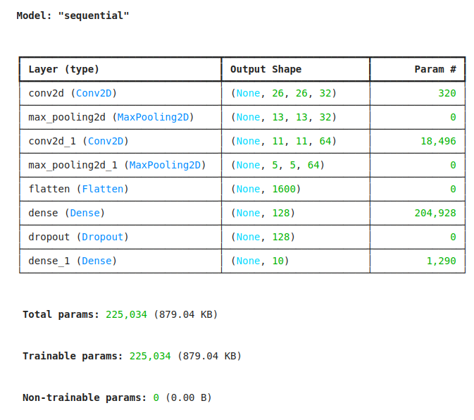
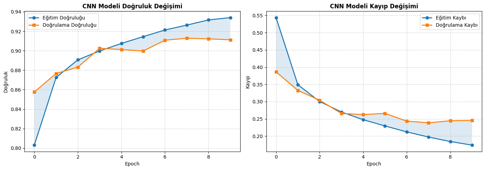
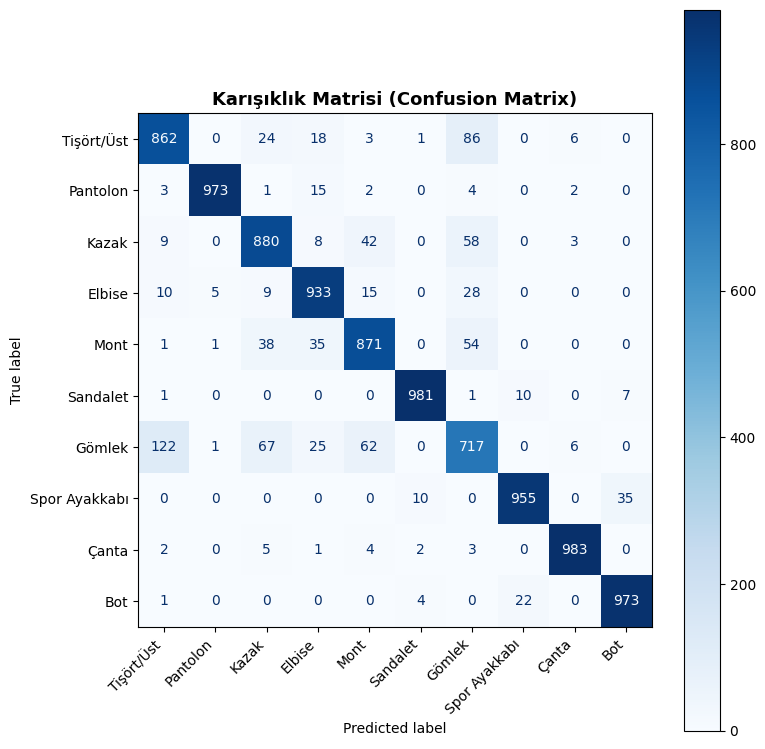

# CNN ile Fashion MNIST Görüntü Sınıflandırma Projesi

## 📌 Proje Açıklaması

Bu proje, **Fashion MNIST** veri seti kullanılarak kıyafet görüntülerinin
sınıflandırılması amacıyla geliştirilmiş bir **Evrişimsel Sinir Ağı (Convolutional Neural Network – CNN)** modelini içermektedir.

Model, **TensorFlow ve Keras** kütüphaneleri kullanılarak sıfırdan eğitilmiş ve
başarımı test verileri üzerinde değerlendirilmiştir.

Fashion MNIST veri seti, aşağıdaki **10 farklı kıyafet sınıfını** içermektedir:

- T-shirt / Top
- Trouser
- Pullover
- Dress
- Coat
- Sandal
- Shirt
- Sneaker
- Bag
- Ankle boot

---

## 🧠 Model Mimarisi

Oluşturulan CNN mimarisi aşağıdaki temel bileşenlerden oluşmaktadır:

- **Convolutional (Conv2D) katmanları**  
  Görüntülerden kenar, şekil ve desen gibi özelliklerin çıkarılması için

- **ReLU aktivasyon fonksiyonu**  
  Modele doğrusal olmayanlık kazandırmak için

- **MaxPooling katmanları**  
  Özellik haritalarının boyutunu küçültmek ve hesaplama maliyetini azaltmak için

- **Fully Connected (Dense) katmanlar**  
  Öğrenilen özellikleri sınıflara dönüştürmek için

- **Dropout katmanı**  
  Aşırı öğrenmeyi (overfitting) önlemek amacıyla

Modelin görsel mimarisi aşağıda gösterilmektedir:



---

## 📊 Eğitim (Training) Performansı

Model, **Adam optimizer** ve **Sparse Categorical Crossentropy** kayıp fonksiyonu
kullanılarak **10 epoch** boyunca eğitilmiştir.

Eğitim tamamlandıktan sonra model, daha önce hiç görülmemiş test verileri üzerinde
değerlendirilmiştir.

### 🔍 Test Sonuçları

- **Test Kayıp (Loss):** 0.2387
- **Test Doğruluğu (Accuracy):** **%91.28**

Bu sonuçlar, modelin yüksek doğrulukla genelleme yapabildiğini göstermektedir.

---

### 📈 Doğruluk ve Kayıp Grafikleri

Aşağıdaki grafikler, eğitim ve doğrulama süreçlerinde modelin öğrenme davranışını
görselleştirmektedir:



Grafiklerden görülebileceği üzere:

- Model kararlı (stabil) bir şekilde öğrenmiştir
- Overfitting gözlemlenmemektedir
- Eğitim ve doğrulama performansları birbiriyle uyumludur

---

### 🧮 Karmaşıklık Matrisi (Confusion Matrix)

Aşağıdaki karmaşıklık matrisi, modelin her bir sınıf için tahmin performansını
ayrıntılı olarak göstermektedir:



Bu matris sayesinde:

- Yanlış sınıflandırılan örnekler analiz edilebilir
- Modelin güçlü ve zayıf yönleri değerlendirilebilir

---

## 📈 Sonuçlar ve Değerlendirme

- Test doğruluğu yaklaşık **%90 – %92** aralığındadır
- Model, farklı kıyafet türlerini başarıyla ayırt edebilmektedir
- CNN mimarisi, görüntü sınıflandırma problemleri için etkili bir çözüm sunmaktadır
- Daha uzun eğitim süresi veya veri artırma (data augmentation) ile performans artırılabilir

---

## ⚙️ Kullanılan Teknolojiler

- Python
- TensorFlow / Keras
- NumPy
- Matplotlib
- Scikit-learn
- Jupyter Notebook

---

## Projeyi Çalıştırma

Projeyi çalıştırmak için aşağıdaki adımlar izlenmelidir:

```bash
pip install -r requirements.txt
jupyter notebook
```

---

## Projenin Amacı

Bu projenin temel amaçları aşağıda sıralanmıştır:

- **Evrişimsel Sinir Ağlarının (CNN)** çalışma mantığını ve görüntü verileri üzerindeki
  etkinliğini kavramak

- Görüntü sınıflandırma problemlerine **derin öğrenme tabanlı çözümler** geliştirmek

- Ham görüntü verilerinin ön işlenmesi (normalizasyon, yeniden şekillendirme)
  süreçlerini uygulamalı olarak öğrenmek

- Bir CNN modelinin:

  - Tasarlanması
  - Eğitilmesi
  - Test edilmesi
  - Performansının grafikler ve metrikler ile değerlendirilmesi
    aşamalarını bütüncül olarak deneyimlemek

- Eğitim sürecinde oluşabilecek problemleri (overfitting, underfitting vb.)
  gözlemleyerek çözüm yaklaşımlarını anlamak

---

## Genel Değerlendirme

Bu proje kapsamında geliştirilen CNN modeli, Fashion MNIST veri seti üzerinde
**yüksek doğruluk oranı** elde etmiş ve görüntü sınıflandırma görevini başarıyla
yerine getirmiştir.

Elde edilen sonuçlar göstermektedir ki:

- Model, eğitim ve test verileri arasında **iyi bir genelleme performansı**
  sergilemektedir

- Kullanılan mimari, karmaşık olmayan ancak etkili bir CNN yapısı sunmaktadır

- Eğitim sürecinde doğruluk ve kayıp değerleri **kararlı ve tutarlı** bir şekilde
  ilerlemiştir

Bu proje, hem **akademik** hem de **uygulamalı** açıdan derin öğrenme ve bilgisayarla
görme alanında sağlam bir temel oluşturmakta olup, daha ileri seviye projeler için
geliştirilmeye açıktır.
